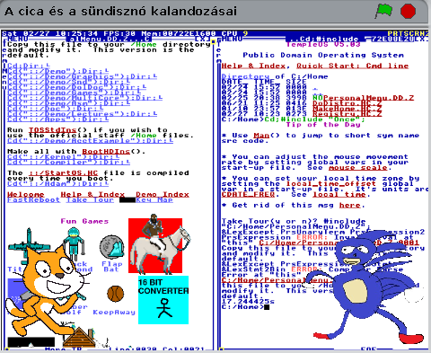

# A cica és a sündisznó kalandozásai
> Scratch Házi Feladat

## Table of contents
* [General info](#general-info)
* [Screenshots](#screenshots)
* [Written in](#written-in)
* [Setup](#setup)
* [Status](#status)
* [Contact](#contact)

## General info
Ebben a kis sztori megismerkedhetünk egy cica és egy sündisznó rövid történetével. Egy érdekes dologra figyelnek fel ami egy ***operációs rendszer***. Ebben a rövid történetben végig kísérhetjük őket ezen a kalandozásukon.
### Warning
**Ebben a projectben hirtelen felvillanó képek és vagy hirtelen, hangos hangefekt előfordulhat!**

## Screenshots

## Written in
Scratch 1.4 (Linux) of 2-Dec-11

## Setup
Ebből a repository-ból le lehet tölteni, majd kicsomagolás után be lehet importálni egy letöltött Scratch alkalmazásba vagy a webes felületen lévő alkalmazásba.
### Vagy
Ezen a [linken](https://scratch.mit.edu/projects/493970559) egyből megtekinthető.

## Status
Project is : _finished_

## Contact
Created by [@VictorBuscsei](https://github.com/VictorBuscsei)   Ebben a readme.md fáljban rejtett üzenet található (view source by clicking "Raw")
<!-- Erre az alkotásomra egyáltalán nem vagyok büszke, borzasztó nagy hülyeségek vannak benne. De legalább a házi feladat teljesítve:D -->
